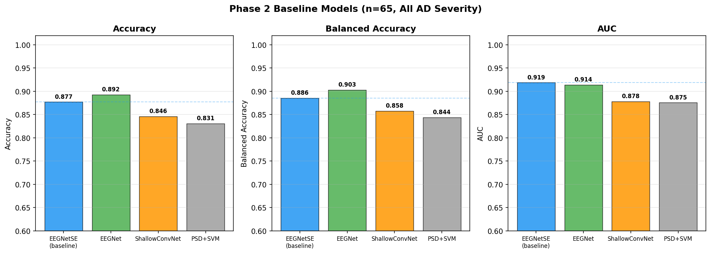
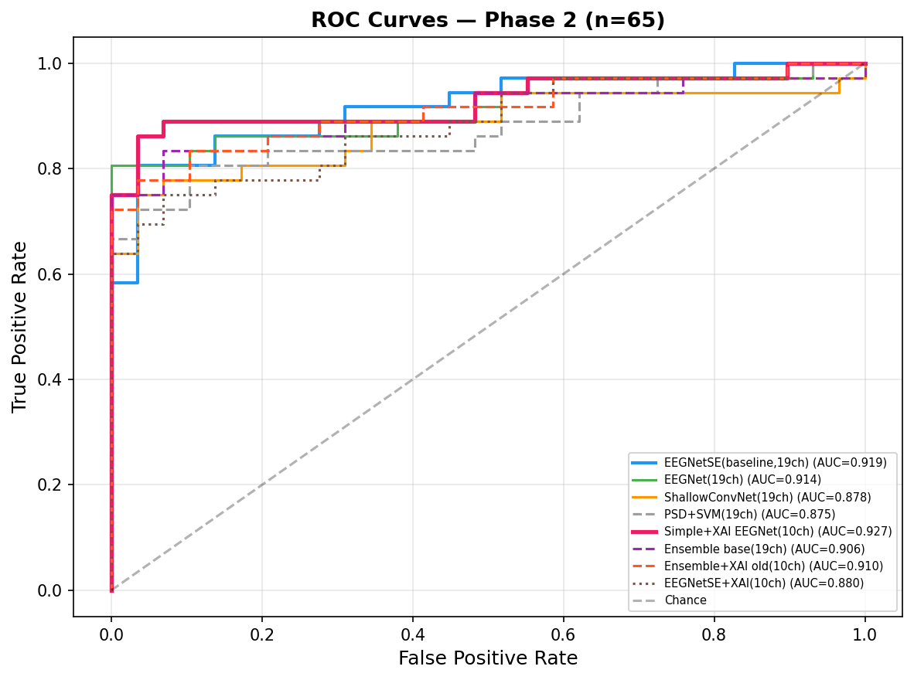
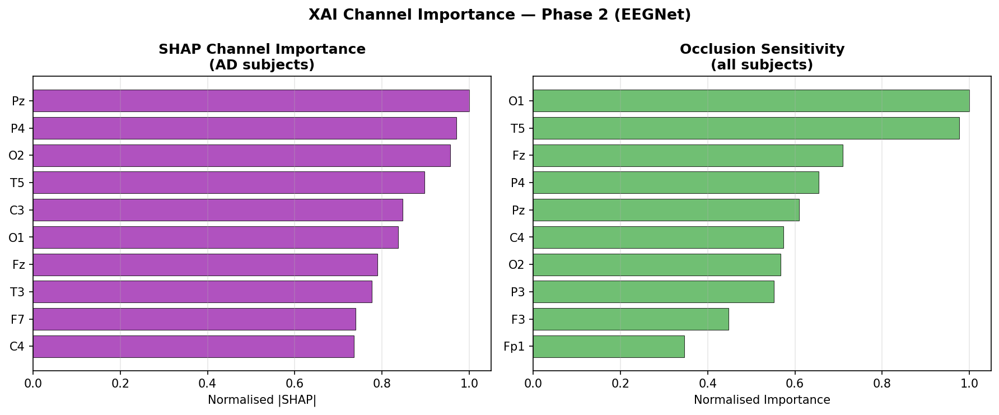
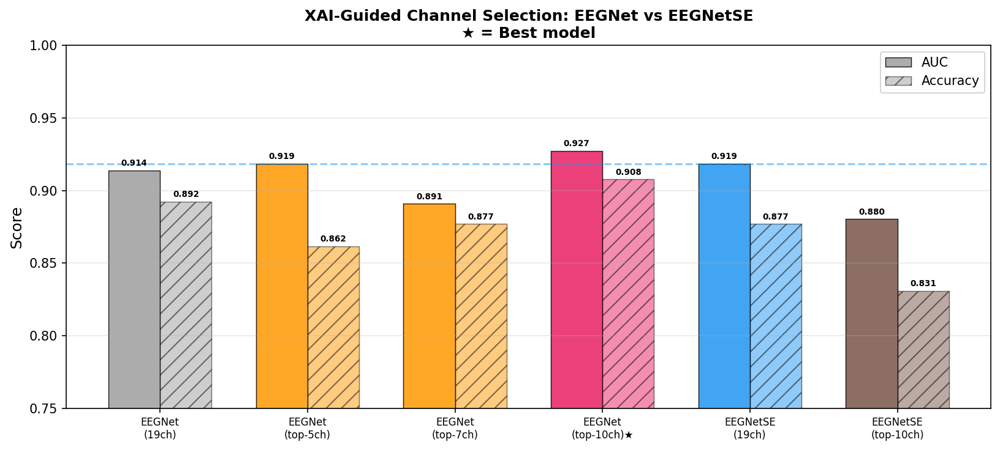
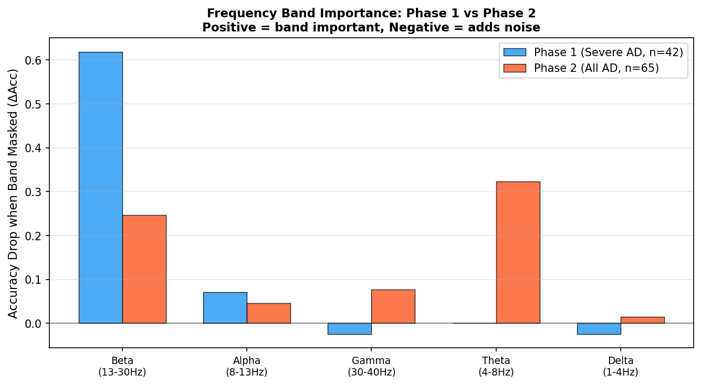
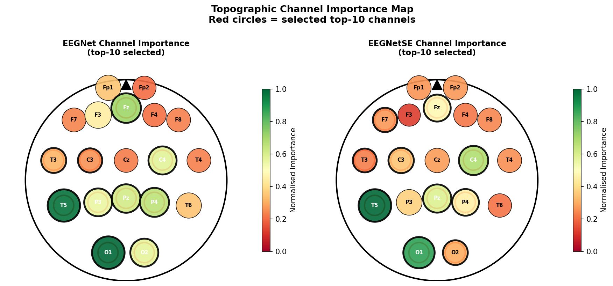
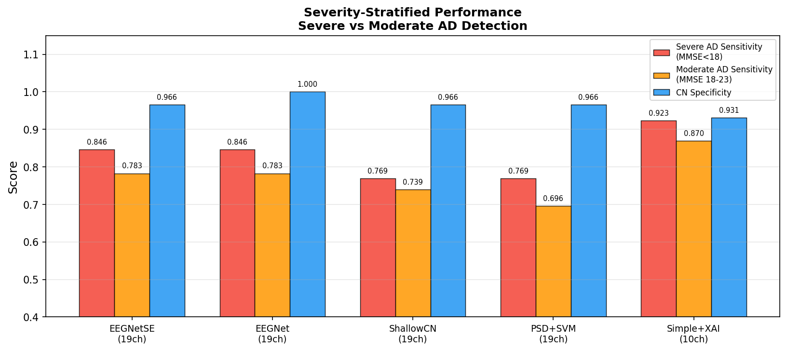
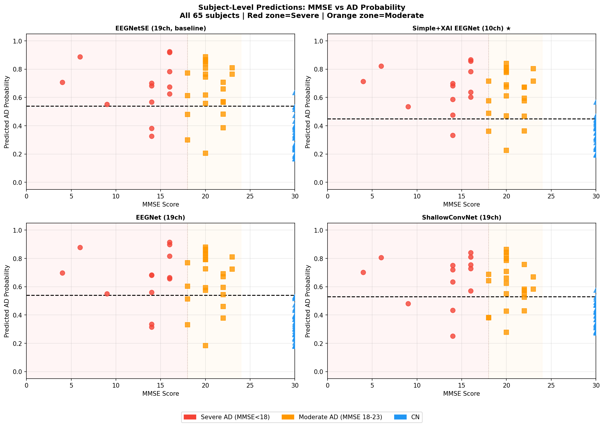
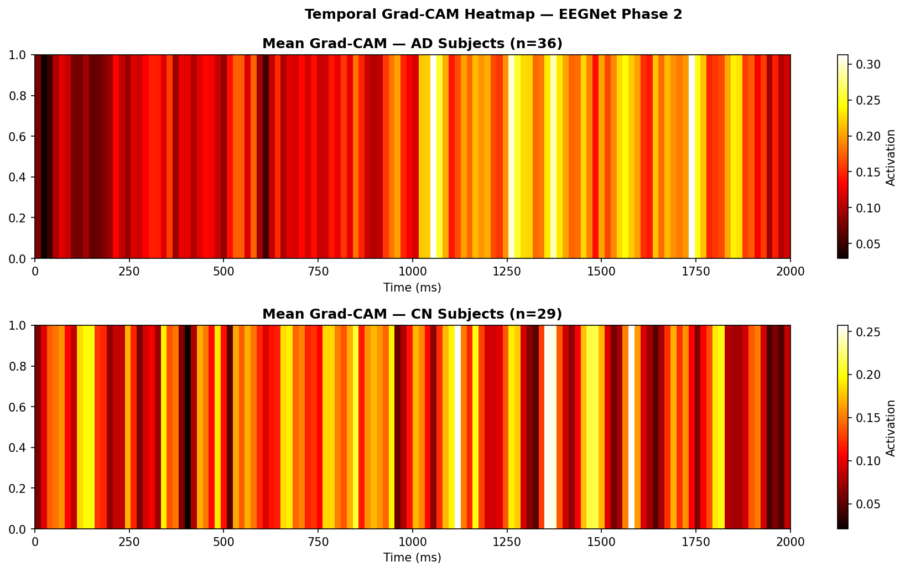
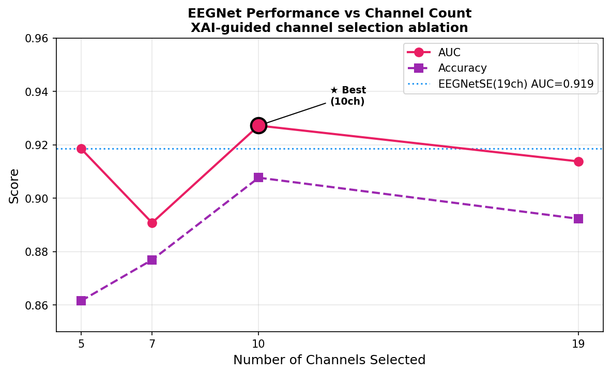

# Severity-Aware EEG Classification of Alzheimer's Disease

> **Associated Paper:** "Severity-Aware EEG Classification of Alzheimer's Disease: From Squeeze-and-Excitation Attention to XAI-Guided Channel Selection Across the Severity Spectrum"  
> Submitted to *Cognitive Neurodynamics* (Springer), April 2026.  
> Authors: K. Prabhakar, Malla Siddharth Reddy, Kaleru Akhila, Prasad Chetti

---

## 🔴 Live Demo
**[Try the Streamlit App →](https://eeg-alzheimers-demo.streamlit.app)**

Upload EEG data and get real-time Alzheimer's disease classification with XAI-guided channel importance visualisation.

---

## Overview

This repository contains the full Phase 2 research code and results for EEG-based Alzheimer's disease (AD) detection using a two-phase methodology:

- **Phase 1** (n=42, severe AD only): EEGNet-SE with Squeeze-and-Excitation attention achieves **AUC = 0.950**
- **Phase 2** (n=65, all severity stages): XAI-guided channel selection (SHAP + occlusion) with EEGNet achieves **AUC = 0.927** using only 10 electrodes

All experiments use **leakage-proof Leave-One-Subject-Out Cross-Validation (LOSO-CV)** to prevent data leakage from EEG segmentation.

---

## Key Results

| Model | Channels | Params | AUC | Sensitivity | Specificity |
|---|---|---|---|---|---|
| EEGNet-SE (Phase 1) | 19 | 1,954 | 0.950 | 0.769 | 1.000 |
| EEGNet+XAI 10ch (Phase 2) | 10 | 1,890 | **0.927** | **0.889** | 0.931 |
| EEGNetSE (Phase 2) | 19 | 1,954 | 0.919 | 0.806 | 0.966 |
| EEGNet (Phase 2) | 19 | 1,890 | 0.914 | 0.806 | 1.000 |
| DeepConvNet | 19 | 154,802 | 0.873 | 1.000 | 0.000 |

---

## XAI-Selected Top-10 Channels

**T5, O1, P4, Pz, O2, Fz, C4, P3, C3, T3** — a posterior and parieto-temporal dominant montage consistent with known AD neurophysiology.

---

## Key Findings

- **XAI improves EEGNet** (+0.013 AUC) but **degrades EEGNet-SE** (−0.038 AUC) — a novel attention-pruning incompatibility
- **Theta band** (4–8 Hz) is useless for severe AD but becomes **critical** (ΔAcc = +0.323) when moderate AD subjects are included
- **DeepConvNet catastrophically overfits** (Spec = 0.000) on small EEG cohorts — lightweight models are essential
- **10 electrodes outperform all 19-channel baselines** — clinically deployable montage

---

## Result Figures

| Baseline Comparison | ROC Curves |
|---|---|
|  |  |

| XAI Channel Importance | XAI Channel Impact |
|---|---|
|  |  |

| Frequency Band Ablation | Topographic Map |
|---|---|
|  |  |

| Severity-Stratified Performance | Subject-Level Predictions |
|---|---|
|  |  |

| GradCAM Temporal Saliency | Channel Count Ablation |
|---|---|
|  |  |

---

## Repository Structure

```
eeg-alzheimers/
├── app.py                          # Streamlit demo application
├── requirements.txt                # Python dependencies
├── notebooks/
│   └── severity_aware_eeg_alzheimers_xai.ipynb  # Full Phase 2 notebook
└── figures/                        # All result figures from Phase 2
    ├── p2_fig1_baseline_comparison.png
    ├── p2_fig2_roc_curves.png
    ├── p2_fig4_xai_channels.png
    └── ... (14 figures total)
```

---

## Dataset

**OpenNeuro ds004504** — Scalp EEG recordings of Alzheimer's disease, frontotemporal dementia and healthy subjects.

- 88 subjects: 29 CN, 36 AD, 23 FTD
- 19-channel, 10-20 system, resting-state eyes-closed
- CC0 licence (public domain)

```
https://openneuro.org/datasets/ds004504
```

---

## Reproducing Results

### Option 1 — Full reproduction from raw data
1. Clone this repository
2. Install dependencies: `pip install -r requirements.txt`
3. Download the raw EEG dataset from OpenNeuro:
   ```
   https://openneuro.org/datasets/ds004504
   ```
4. Run `notebooks/severity_aware_eeg_alzheimers_xai.ipynb` from Section 1

### Option 2 — Load saved checkpoints (skip retraining)
1. Clone this repository
2. Install dependencies: `pip install -r requirements.txt`
3. Download the precomputed checkpoints from Kaggle:
   ```
   https://www.kaggle.com/datasets/siddhu2021/eeg-ad-phase2-checkpoints
   ```
4. Place the downloaded `.pkl` files in a folder called `eeg_checkpoints/`
5. Run `notebooks/severity_aware_eeg_alzheimers_xai.ipynb` — the notebook will automatically load from checkpoints and skip retraining

---

## Citation

If you use this code or findings in your research, please cite:

```
Prabhakar K, Reddy MS, Akhila K, Chetti P (2026)
Severity-Aware EEG Classification of Alzheimer's Disease:
From Squeeze-and-Excitation Attention to XAI-Guided Channel
Selection Across the Severity Spectrum.
Cognitive Neurodynamics (under review).
```

---

## License

Code: MIT License  
Dataset: CC0 (OpenNeuro ds004504)
